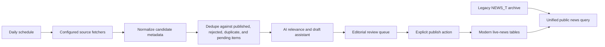

# Automated News Discovery Plan

## As implemented (2026)

The first code slice is live in the repository:

- `QueenZone.NewsAgent` + `QueenZone.NewsAgent.Worker` — fetch, triage, draft generation
- Discovery data in modern tables via `QueenZone.Data` (not `NEWS_T`)
- Admin review at `/admin/news-discovery`; publish still explicit via `/admin/news`
- Operational docs: `docs/architecture/news-agent.md`

Remaining MVP work: scheduled hosting (#107), fuller promote workflow polish (#106), observability (#108).

## Goal

Issue #7 proposes a daily workflow that discovers Queen-related news, prepares AI-assisted draft material, and leaves publication decisions with a human editor.

This supports the live-news side of the archive-first launch. It should be designed so public news pages can combine legacy archive news from `NEWS_T` with newly approved articles from separate modern tables, while publishing still requires a minimal editorial review surface.

## Principles

- Never publish AI-generated or externally sourced news automatically.
- Keep discovery, drafting, review, and publishing as separate steps.
- Store source metadata and AI output so every draft can be audited.
- Prefer a curated source list before broad search or social monitoring.
- Deduplicate aggressively before creating review work.
- Treat legacy `NEWS_T` as historical archive content.
- Store newly approved live articles in separate modern tables, not in `NEWS_T`.
- Make the public news experience seamless across legacy and new article storage.
- Keep the public site resilient if the discovery job, AI provider, or source fetcher fails.

## Recommended First Version

Use a scheduled worker that writes to modern review tables, not directly to published news rows. When an editor approves an article, publish it into modern live-news tables. Do not insert the new article into `NEWS_T`.

The first production-friendly cloud implementation should use Azure Functions Timer Trigger or an App Service WebJob. GitHub Actions is acceptable for a proof of concept, but it is less suitable once the job needs private admin state, queue retries, database writes, and operational telemetry.

An always-on local Windows 11 computer can also coordinate the first version through Task Scheduler or a small local worker. This is a good low-cost pilot path if the machine is already on, because it avoids extra cloud scheduler cost and makes manual inspection easier. Treat this as an operator-run ingestion tool, not a public-site dependency. If the machine is offline, discovery can pause without affecting the public read-only archive.

## Source Strategy

Start with sources that have explicit feeds or stable public pages:

- Official Queen channels.
- Brian May, Roger Taylor, and related official channels where relevant.
- Music news RSS feeds with known attribution quality.
- Manually configured high-signal fan or archive sources.

Avoid broad social scraping in the first version. Bluesky, X, Reddit, Google, and Bing can be later source adapters after moderation and rate-limit rules are proven.

Each source should be configured with:

- Source key.
- Display name.
- Homepage URL.
- Feed or API URL.
- Polling frequency.
- Attribution requirements.
- Enabled flag.
- Trust tier.

## Data Model

Use modern tables for live-news and workflow state. Suggested names are placeholders.

### LiveNewsArticle

- `Id`
- `Title`
- `Slug`
- `Excerpt`
- `Body`
- `PublishedAt`
- `SourceUrl`
- `SourceName`
- `Status`
- `CreatedBy`
- `ApprovedBy`
- `CreatedAt`
- `UpdatedAt`

Only approved rows should be visible through the public news query.

### NewsSource

- `Id`
- `Key`
- `DisplayName`
- `HomepageUrl`
- `FeedUrl`
- `TrustTier`
- `Enabled`
- `LastFetchedAt`
- `CreatedAt`
- `UpdatedAt`

### NewsCandidate

- `Id`
- `SourceId`
- `SourceUrl`
- `CanonicalSourceUrl`
- `SourceTitle`
- `SourcePublishedAt`
- `DiscoveredAt`
- `ContentHash`
- `UrlHash`
- `Status`
- `RelevanceScore`
- `DuplicateOfCandidateId`
- `DuplicateOfPublishedNewsId`
- `DuplicateOfLiveNewsArticleId`
- `CreatedAt`
- `UpdatedAt`

Recommended statuses:

- `PendingTriage`
- `NeedsReview`
- `Rejected`
- `Duplicate`
- `IgnoredSource`
- `ApprovedForDraft`
- `Published`
- `Errored`

### NewsDraft

- `Id`
- `CandidateId`
- `ProposedTitle`
- `ProposedExcerpt`
- `ProposedBody`
- `AttributionText`
- `EditorNotes`
- `AiModel`
- `AiPromptVersion`
- `AiGeneratedAt`
- `CreatedAt`
- `UpdatedAt`

The draft body should be original editorial draft material, not copied article text. Store brief source excerpts only when licensing and fair-use guidance allows it.

### NewsReviewEvent

- `Id`
- `CandidateId`
- `Action`
- `Actor`
- `Reason`
- `CreatedAt`

Use this table for approve, edit, reject, duplicate, ignore-source, and publish audit history.

## Dedupe Rules

Run deterministic dedupe before AI work:

- Normalize URLs by removing tracking parameters and lowercasing host names.
- Match exact normalized URL against pending, rejected, duplicate, and published items.
- Match source title similarity within a recent window.
- Match content hash when source summaries are available.
- Treat syndication as one story with multiple source references, not separate publishable items.

Run AI-assisted similarity only after deterministic checks pass. AI can suggest a duplicate, but deterministic rules and editor review should own final status.

## AI Role

The AI step should produce internal draft assistance:

- Relevance classification.
- Short factual summary.
- Suggested title.
- Suggested excerpt.
- Suggested body outline or draft.
- Mentioned people, dates, albums, tours, releases, and source attribution.
- Confidence score and uncertainty notes.

The AI step must not:

- Publish directly.
- Invent facts beyond the source material.
- Rewrite entire source articles as if they were QueenZone reporting.
- Remove attribution.
- Treat low-confidence gossip as confirmed news.

Prompts should require source-grounded output, uncertainty disclosure, and a concise editorial style. Store model name and prompt version with each draft.

## Admin Review

The admin surface can be simple at first:

- List candidates by status and discovered date.
- Show source link, source metadata, AI summary, proposed draft, duplicate warnings, and review history.
- Allow edit, approve, reject, mark duplicate, ignore source, and publish.
- Require explicit confirmation before publication.
- Keep rejected and duplicate candidates so they suppress future repeats.

Publishing should create or update a row in modern live-news tables. It should not mutate `NEWS_T`. Public pages should query a unified news read layer that merges published legacy archive rows with approved live-news rows.

## Operational Design

The scheduled job should:

- Run daily.
- Support Windows Task Scheduler as an early coordinator.
- Be manually runnable in development.
- Use idempotent source fetch and candidate creation.
- Log source fetch failures separately from AI failures.
- Continue processing other sources when one source fails.
- Respect source rate limits.
- Emit Application Insights telemetry for fetched, created, duplicate, rejected, errored, and AI-token counts.

Secrets and configuration:

- Source API keys, if any, belong in App Service or Function configuration.
- AI provider credentials belong in secret configuration, never in git.
- Local examples belong in ignored local settings and committed `.example` files only.
- Local Windows runs should use user-level secrets, environment variables, or ignored local settings. Do not place API keys in `.ps1`, `.bat`, or scheduled-task XML files committed to the repository.

For a local Windows coordinator, the job should:

- Run as a .NET console/import command or worker with a clear `discover-news` command.
- Write candidates to the same review database or export a review file that the admin workflow can import.
- Keep a local log file in an ignored path and optionally send telemetry when configured.
- Use a lock file or database lease so overlapping scheduled runs do not process the same source twice.
- Exit non-zero on infrastructure failure so Task Scheduler history can show failed runs.

## Testing

Default tests should use fake source fetchers, fake clock, fake AI client, and deterministic sample data.

Coverage should include:

- URL normalization.
- Source fetch abstraction.
- Dedupe against pending candidates.
- Dedupe against rejected and duplicate candidates.
- Dedupe against published news.
- Unified public news ordering across legacy `NEWS_T` rows and modern live-news rows.
- Candidate creation.
- Draft creation from AI output.
- Rejection suppresses future proposals.
- No-auto-publish safeguard.
- Job failure handling does not break the public app.

Real external source and AI calls should be opt-in integration checks, not required in normal pull request CI.

## Suggested Implementation Sequence

1. Add the modern live-news, workflow, and status tables.
2. Add source-fetcher interfaces and one RSS source adapter.
3. Add URL normalization and deterministic dedupe.
4. Add candidate creation without AI.
5. Add fake-AI tests and an AI provider abstraction.
6. Add the scheduled job and manual development command.
7. Add an optional Windows Task Scheduler wrapper for the always-on local machine.
8. Add the review queue.
9. Add explicit publish into modern live-news tables.
10. Add telemetry and operational documentation.
11. Add more source adapters only after the first source works end to end.

## Open Decisions

- Whether the first implementation uses Azure Functions Timer Trigger or App Service WebJob.
- Whether the first scheduler should run from the always-on Windows 11 machine before moving to Azure.
- Which AI provider and model to use.
- Whether the AI writes full draft prose or only internal editorial notes.
- Whether modern editorial tables live beside the legacy import database or in a separate database.
- Who counts as an admin user before public login returns.
