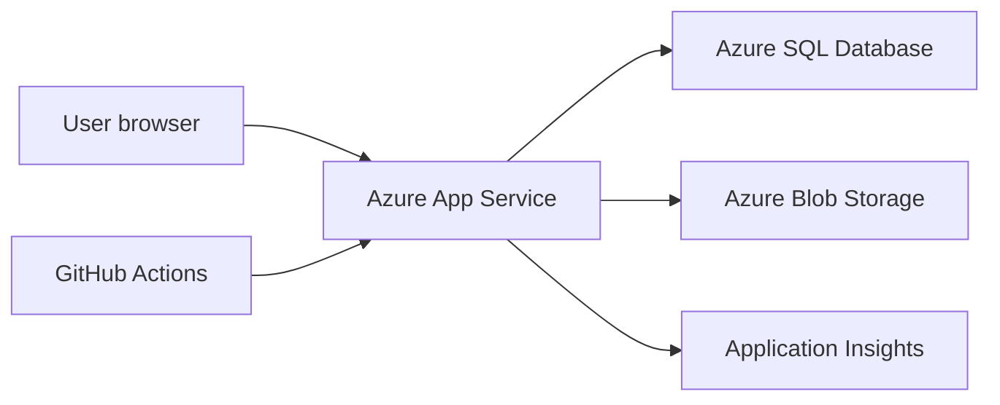

# Azure Hosting Plan

## Initial Azure Architecture



## Recommended Services

| Concern | Azure Service | Notes |
| --- | --- | --- |
| Web app | Azure App Service | Linux is fine for ASP.NET Core. Windows only needed for legacy Web Forms. |
| Database | Azure SQL Database | Restore or import legacy DB, then connect read-only at first. |
| Media | Azure Blob Storage | Pictures, thumbnails, downloadable public assets. |
| Telemetry | Application Insights | Request tracking, exceptions, dependency timings. Keep sampling and daily caps low for the hobby budget. |
| Secrets | App Service settings or Key Vault | Start with App Service settings, move to Key Vault if needed. |
| DNS/TLS | App Service custom domain or Azure Front Door | Front Door can wait. |
| CI/CD | GitHub Actions | Build, test, deploy. |

## Environments

Start with:

- Local development.
- Azure preview.
- Production.

Optional later:

- Staging slot for production swaps.

## Configuration

Use configuration keys like:

- `ConnectionStrings:QueenZoneLegacy`
- `APPLICATIONINSIGHTS_CONNECTION_STRING`
- `Storage:PublicMediaBaseUrl`
- `FeatureFlags:ForumArchiveEnabled`
- `FeatureFlags:LegacyRedirectsEnabled`

Application Insights telemetry is enabled in `QueenZone.Web` only when
`APPLICATIONINSIGHTS_CONNECTION_STRING` is configured. The app uses Azure Monitor
OpenTelemetry with conservative defaults in `ApplicationInsights`: 0.2 traces per
second, warning-or-higher exported logs, trace-based log sampling, and Live
Metrics disabled. In Azure, configure a small daily cap on both Application
Insights and the backing Log Analytics workspace so unexpected telemetry volume
is budget-contained.

## Monitoring

Preview monitoring resources in `Queenzone-RG`:

- Log Analytics workspace: `queenzone-dev-law`, 30-day retention, 0.1 GB/day cap.
- Application Insights: `queenzone-dev-ai`, workspace-backed.
- Action group: `queenzone-alerts`, email receiver `richard@thinkingwebsites.com.au`.
- Availability test: `queenzone-dev-health`, `https://queenzone-dev.azurewebsites.net/health`, every 15 minutes, five locations, retries enabled, SSL check enabled.

Alerts:

- `queenzone-dev-health-unavailable`: availability below 80% over 15 minutes.
- `queenzone-dev-failed-requests`: more than 10 failed requests over 15 minutes.
- `queenzone-dev-server-exceptions`: more than 5 server exceptions over 15 minutes.
- `queenzone-dev-ingestion-warning`: billable workspace usage over 80 MB in 24 hours, ahead of the 0.1 GB/day cap.

Operating rhythm:

- After deployment, check `/health` and confirm request telemetry appears in Application Insights.
- Weekly, review Failures, Performance, Dependencies, and workspace ingestion.
- Monthly, tune alert thresholds and the daily cap based on observed traffic.
- Keep alerting email-only unless the project becomes operationally critical.

## Public Media Delivery

Public archive media is served from Azure Blob Storage through Cloudflare:

```text
Visitor URL: https://pictures.queenzone.org/{container}/{blob}
Cloudflare Worker: pictures-queenzone-org
Worker route: pictures.queenzone.org/*
Azure origin: https://queenzone.blob.core.windows.net
Storage account: queenzone
```

The Worker is used because Cloudflare Free supports proxied DNS and Workers, but Host header, SNI, and DNS origin overrides in Origin Rules are Enterprise-only. Azure Blob Storage rejects direct proxied requests to `pictures.queenzone.org` unless the request to Azure uses the storage account host. The Worker fetches the equivalent Azure Blob URL directly, avoiding the need for Enterprise Origin Rules.

The Cloudflare DNS record should remain:

```text
Type: CNAME
Name: pictures
Target: queenzone.blob.core.windows.net
Proxy status: Proxied
TTL: Auto
```

Worker behavior as configured on 2026-06-25:

- Accepts `GET` and `HEAD` only.
- Maps the request path and query string to `https://queenzone.blob.core.windows.net`.
- Adds `Access-Control-Allow-Origin: *`.
- Adds `X-Content-Type-Options: nosniff`.
- Sets `Cache-Control: public, max-age=86400, s-maxage=2592000`.
- Uses Cloudflare edge cache for non-range `GET` responses.

Azure requirements:

- `queenzone` must keep blob public access enabled.
- Public archive containers must remain public where visitor access is expected.
- Private containers such as `databasebackup` and `songfiles` should remain private.

Do not configure Azure CDN, Azure Front Door, or an Azure Storage custom domain for `pictures.queenzone.org` unless the architecture is deliberately changed.

## Database Access

The `queenzone-dev` App Service connects to the `queenzone-db` Azure SQL database on `queenzone-sql-server.database.windows.net`.

The current runtime route uses SQL authentication. Store the runtime connection string only in the App Service setting `ConnectionStrings__QueenZoneLegacy`:

```text
Server=tcp:queenzone-sql-server.database.windows.net,1433;Database=queenzone-db;User ID=...;Password=...;Encrypt=True;TrustServerCertificate=False;
```

GitHub Actions uses a separate `QUEENZONE_LEGACY_MIGRATION_CONNECTION_STRING` environment secret for EF Core migrations during deployment. Updating that GitHub secret does not update the live App Service runtime setting.

Create the runtime database user inside the target database, not `master`, and grant only the permissions required by the enabled application paths:

```sql
CREATE USER [app_login_name] FOR LOGIN [app_login_name];
ALTER ROLE db_datareader ADD MEMBER [app_login_name];
```

Local development should use local-only secrets in `appsettings.Local.json`, shell environment variables, or `.env`. Do not commit copied Azure connection strings.

Only grant write permissions when the deployed app has an intentional write path:

```sql
ALTER ROLE db_datawriter ADD MEMBER [app_login_name];
```

Admin news publishing is an intentional write path, so the production runtime login needs write access for `NEWS_T` and `NewsAuditLog` once that workflow is enabled.

## Deployment Checklist

- Build succeeds in GitHub Actions.
- Tests pass.
- App starts without database write permissions.
- Health endpoint returns OK.
- Application Insights receives requests.
- Canonical URLs are tested.
- No connection strings or secrets are committed.
- App Service runtime settings and GitHub environment secrets are both updated when database credentials rotate.
