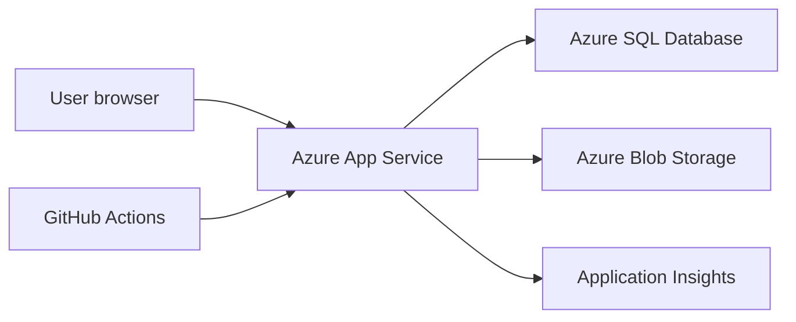

# Azure Hosting Plan

## Initial Azure Architecture



## Recommended Services

| Concern | Azure Service | Notes |
| --- | --- | --- |
| Web app | Azure App Service | Linux is fine for ASP.NET Core. Windows only needed for legacy Web Forms. |
| Database | Azure SQL Database | Restore or import legacy DB, then connect read-only at first. |
| Media | Azure Blob Storage | Pictures, thumbnails, downloadable public assets. |
| Telemetry | Application Insights | Request tracking, exceptions, dependency timings. |
| Secrets | App Service settings or Key Vault | Start with App Service settings, move to Key Vault if needed. |
| DNS/TLS | App Service custom domain or Azure Front Door | Front Door can wait. |
| CI/CD | GitHub Actions | Build, test, deploy. |

## Environments

Start with:

- Local development.
- Azure preview.
- Production.

Optional later:

- Staging slot for production swaps.

## Configuration

Use configuration keys like:

- `ConnectionStrings:QueenZoneLegacy`
- `Storage:PublicMediaBaseUrl`
- `FeatureFlags:ForumArchiveEnabled`
- `FeatureFlags:LegacyRedirectsEnabled`

## Database Access

The `queenzone-dev` App Service connects to the `queenzone-db` Azure SQL database on `queenzone-sql-server.database.windows.net`.

The current runtime route uses SQL authentication. Store the runtime connection string only in the App Service setting `ConnectionStrings__QueenZoneLegacy`:

```text
Server=tcp:queenzone-sql-server.database.windows.net,1433;Database=queenzone-db;User ID=...;Password=...;Encrypt=True;TrustServerCertificate=False;
```

GitHub Actions uses a separate `QUEENZONE_LEGACY_MIGRATION_CONNECTION_STRING` environment secret for EF Core migrations during deployment. Updating that GitHub secret does not update the live App Service runtime setting.

Create the runtime database user inside the target database, not `master`, and grant only the permissions required by the enabled application paths:

```sql
CREATE USER [app_login_name] FOR LOGIN [app_login_name];
ALTER ROLE db_datareader ADD MEMBER [app_login_name];
```

Local development should use local-only secrets in `appsettings.Local.json`, shell environment variables, or `.env`. Do not commit copied Azure connection strings.

Only grant write permissions when the deployed app has an intentional write path:

```sql
ALTER ROLE db_datawriter ADD MEMBER [app_login_name];
```

Admin news publishing is an intentional write path, so the production runtime login needs write access for `NEWS_T` and `NewsAuditLog` once that workflow is enabled.

## Deployment Checklist

- Build succeeds in GitHub Actions.
- Tests pass.
- App starts without database write permissions.
- Health endpoint returns OK.
- Application Insights receives requests.
- Canonical URLs are tested.
- No connection strings or secrets are committed.
- App Service runtime settings and GitHub environment secrets are both updated when database credentials rotate.
