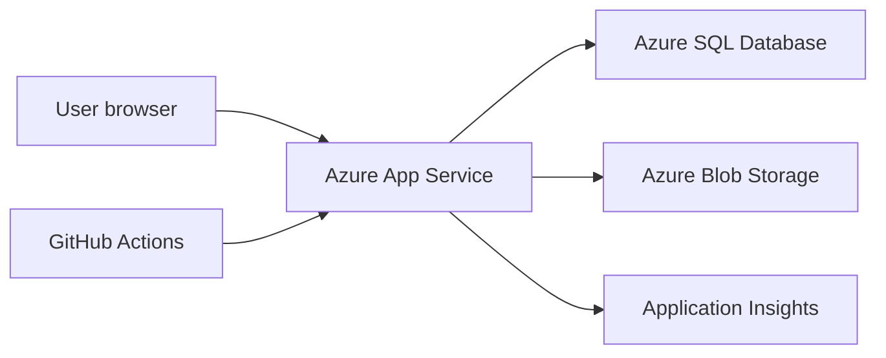

# Azure Hosting Plan

## Initial Azure Architecture



## Recommended Services

| Concern | Azure Service | Notes |
| --- | --- | --- |
| Web app | Azure App Service | Linux is fine for ASP.NET Core. Windows only needed for legacy Web Forms. |
| Database | Azure SQL Database | Restore or import legacy DB, then connect read-only at first. |
| Media | Azure Blob Storage | Pictures, thumbnails, downloadable public assets. |
| Telemetry | Application Insights | Request tracking, exceptions, dependency timings. |
| Secrets | App Service settings or Key Vault | Start with App Service settings, move to Key Vault if needed. |
| DNS/TLS | App Service custom domain or Azure Front Door | Front Door can wait. |
| CI/CD | GitHub Actions | Build, test, deploy. |

## Environments

Start with:

- Local development.
- Azure preview.
- Production.

Optional later:

- Staging slot for production swaps.

## Configuration

Use configuration keys like:

- `ConnectionStrings:QueenZoneLegacy`
- `Storage:PublicMediaBaseUrl`
- `FeatureFlags:ForumArchiveEnabled`
- `FeatureFlags:LegacyRedirectsEnabled`

## Database Access

The `queenzone-dev` App Service connects to the `queenzone-dev-db` Azure SQL database on `queenzone-sql-server.database.windows.net` with its system-assigned Managed Identity.

Create the matching SQL user inside the target database, not `master`:

```sql
CREATE USER [queenzone-dev] FROM EXTERNAL PROVIDER;
ALTER ROLE db_datareader ADD MEMBER [queenzone-dev];
```

The App Service setting `ConnectionStrings__QueenZoneLegacy` should use Managed Identity authentication and should not include a SQL password.

Local development can connect to the same Azure SQL database with Entra authentication:

```text
Server=tcp:queenzone-sql-server.database.windows.net,1433;Database=queenzone-dev-db;Authentication=Active Directory Default;Encrypt=True;TrustServerCertificate=False;
```

The local Entra principal is `richard@thinkingwebsites.com.au`. Grant it database permissions explicitly in `queenzone-dev-db`, starting with `db_datareader` and adding write permissions only for intentional write-path testing.

Only grant write permissions when the deployed app has an intentional write path:

```sql
ALTER ROLE db_datawriter ADD MEMBER [queenzone-dev];
```

The application should not need write access for Phase 1.

## Deployment Checklist

- Build succeeds in GitHub Actions.
- Tests pass.
- App starts without database write permissions.
- Health endpoint returns OK.
- Application Insights receives requests.
- Canonical URLs are tested.
- No connection strings or secrets are committed.
