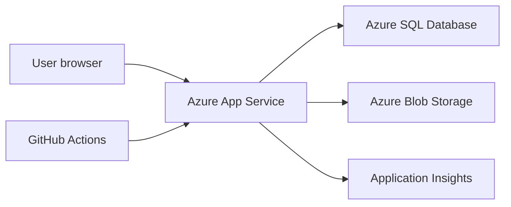

# Azure Hosting Plan

## Initial Azure Architecture



## Recommended Services

| Concern | Azure Service | Notes |
| --- | --- | --- |
| Web app | Azure App Service | Linux is fine for ASP.NET Core. Windows only needed for legacy Web Forms. |
| Database | Azure SQL Database | Restore or import legacy DB, then connect read-only at first. |
| Media | Azure Blob Storage | Pictures, thumbnails, downloadable public assets. |
| Telemetry | Application Insights | Request tracking, exceptions, dependency timings. Keep sampling and daily caps low for the hobby budget. |
| Secrets | App Service settings or Key Vault | Start with App Service settings, move to Key Vault if needed. |
| DNS/TLS | App Service custom domain or Azure Front Door | Front Door can wait. |
| CI/CD | GitHub Actions | Build, test, deploy. |

## Environments

Start with:

- Local development.
- Azure preview.
- Production.

Optional later:

- Staging slot for production swaps.

## Scale and cost model (single instance)

Production runs on **one** App Service worker on plan **ASP-Queenzone** (**B1 Basic**). That is intentional: stay on the lowest paid plan currently in use and **do not** add Azure Cache for Redis or other paid distributed cache for multi-instance correctness.

Process-local caches (public query cache, output cache, in-memory rate-limit hints) are therefore the correct design. Multi-instance scale-out and Redis are **archived / not planned** until budget and traffic force a revisit.

Full decision, live SKU notes, and what remains in scope: [`hosting-scale-and-cache.md`](hosting-scale-and-cache.md).

## Configuration

Use configuration keys like:

- `ConnectionStrings:QueenZoneLegacy`
- `APPLICATIONINSIGHTS_CONNECTION_STRING`
- `Storage:PublicMediaBaseUrl`
- `AzureAd:ClientId` / `AzureAd:TenantId` / related Entra settings (required outside Development)
- `AllowedHosts` (production default: `www.queenzone.org;queenzone.org;*.azurewebsites.net`)
- `FeatureFlags:ForumArchiveEnabled`
- `FeatureFlags:LegacyRedirectsEnabled`

### Production auth and host hardening

- **Entra admin auth is mandatory** when `ASPNETCORE_ENVIRONMENT` is not `Development` or `Testing`. Placeholder values such as `YOUR_CLIENT_ID` do not count. The process throws at startup if admin Entra is not configured.
- **Do not** enable header-based `X-Test-User-Email` admin auth on App Service. That path only exists for local Development and the automated Testing environment.
- **AllowedHosts** is locked down in committed `appsettings.json`. Prefer App Service application settings to extend the host list when adding domains rather than shipping `AllowedHosts=*`.
- **Admin allowlist:** committed `Admin:AllowedEmails` is **empty**. Production must set `Admin__AllowedEmails__0` (and further indexes) on App Service or via Key Vault. Startup validation fails in Production/Staging/Preview when the list is empty. See [`entra-admin-auth.md`](entra-admin-auth.md).
- **Secrets in logs:** never log connection strings, client secrets, storage keys, or API keys. Prefer App Service setting name + length when auditing config; health endpoints must not echo exception text containing secrets.

### Forwarded headers trust boundary

The app clears `KnownIPNetworks` / `KnownProxies` so `X-Forwarded-For`, `X-Forwarded-Proto`, and `X-Forwarded-Host` from **App Service / Cloudflare** are accepted (required for correct OAuth redirect URIs and scheme).

| Trust | Implication |
| --- | --- |
| Edge is the only public ingress | Normal production path — forwarded headers are trusted |
| Client reaches Kestrel without the edge | Client can spoof `X-Forwarded-For` (and thus IP-based rate-limit partitions) |

**Policy:**

- Treat **IP-based rate limits as soft** (auth start, search, anonymous partitions).
- Prefer **authenticated member id** for write/upload rate partitions when a principal is present.
- Forum post limits use **member id + DB count**, not IP.
- Do not put private admin actions behind IP allowlists derived from `X-Forwarded-For` alone.

If a second public path to the app is ever opened (direct App Service hostname without Cloudflare, extra VNet ingress), re-evaluate this model or terminate TLS only at a single trusted reverse proxy.

### Rate limiting (process-local, single B1)

Named policies (429 when exceeded):

| Policy | Surfaces | Partition | Default |
| --- | --- | --- | --- |
| `qz-auth` | `/account/login`, `/account/externallogin` | Client IP | 30 / minute |
| `qz-member-write` | `/submit/*` | Member id, else IP | 20 / minute |
| `qz-upload` | editor image API, account settings (avatar) | Member id, else IP | 30 / minute |
| `qz-search` | `/search` | Client IP | 60 / minute |
| Fan performance | audio / browse | Member or IP | Config section `RateLimiting:FanPerformances` |
| Forum posts | new thread / reply | Member + DB probe | 5 / minute; **fail-closed** if probe errors |

No Redis: limits are per process. Correct on single-instance B1; see [`hosting-scale-and-cache.md`](hosting-scale-and-cache.md).

**Runbook (live Entra app, App Service keys, secret rotation):** see [`docs/architecture/entra-admin-auth.md`](entra-admin-auth.md).

Summary of what is live on App Service `queenzone-dev` (as of 2026-07-23):

| Item | Note |
| --- | --- |
| Entra app | **QueenZone Admin** — client ID `f6d32f3b-7a4e-4517-a4d1-0995caad8feb` |
| Settings | `AzureAd__Instance`, `TenantId` (`common`), `ClientId`, `ClientSecret`, `CallbackPath` |
| Admin allowlist | `Admin__AllowedEmails__N` on App Service (not committed appsettings) |
| Secret renewal | Client secret created 2026-07-23 for 2 years — **renew by 2028-07-01** (procedure in entra-admin-auth.md) |
| Member OAuth | Separate app **queenzone member login** and `Authentication__*` settings — not the admin OIDC app |

### Health probes

| Path | Purpose | Dependencies |
| --- | --- | --- |
| `/health` | **Liveness** — process is up | None (always cheap JSON `{ "status": "ok" }`) |
| `/health/ready` | **Readiness** — can serve traffic that needs SQL/blob | SQL when `ConnectionStrings:QueenZoneLegacy` is set; blob when `ConnectionStrings:BlobStorage` is set. Unconfigured dependencies report **Healthy** with a "not configured" description (sample-data local mode). Failures return **503** without secrets or exception text. |

Use `/health` for App Service / CI pings. Point deeper monitors at `/health/ready` when you want SQL/blob failure to page.

### SQL Server EF options (runtime)

- Default command timeout: **30s** (was 300s) so runaway public queries release connections sooner.
- `EnableRetryOnFailure` for Azure SQL transient faults (5 retries, max delay 20s).
- Design-time migrations / long tools still use a **300s** timeout via `QueenZoneDbContextFactory`.
- Hot forum paths that need longer still raise timeout per command in those repositories.

### News discovery outbound HTTP (SSRF)

The news agent worker fetches admin-configured feed/page URLs. Guards:

- Absolute **http/https** URLs only (no `file:`, `gopher:`, etc.).
- Hostnames such as `localhost`, `*.local`, `*.internal`, cloud metadata names blocked.
- After DNS, connections to private/link-local/CGNAT/metadata address ranges are refused (including redirect hops via `SocketsHttpHandler.ConnectCallback`).
- Response body capped (default 5 MB).

See `QueenZone.NewsAgent.OutboundUrlSafety` and `SsrfSafeSocketsHttpHandler`.

Application Insights telemetry is enabled in `QueenZone.Web` only when
`APPLICATIONINSIGHTS_CONNECTION_STRING` is configured. The app uses Azure Monitor
OpenTelemetry with conservative defaults in `ApplicationInsights`: 0.2 traces per
second, warning-or-higher exported logs, trace-based log sampling, and Live
Metrics disabled. In Azure, configure a small daily cap on both Application
Insights and the backing Log Analytics workspace so unexpected telemetry volume
is budget-contained.

## Public Media Delivery

Public archive media is served from Azure Blob Storage through Cloudflare:

```text
Visitor URL: https://cdn.queenzone.org/{container}/{blob}
Cloudflare Worker: pictures-queenzone-org
Worker route: cdn.queenzone.org/*
Azure origin: https://queenzone.blob.core.windows.net
Storage account: queenzone
```

The Worker is used because Cloudflare Free supports proxied DNS and Workers, but Host header, SNI, and DNS origin overrides in Origin Rules are Enterprise-only. Azure Blob Storage rejects direct proxied requests to `cdn.queenzone.org` unless the request to Azure uses the storage account host. The Worker fetches the equivalent Azure Blob URL directly, avoiding the need for Enterprise Origin Rules.

The Cloudflare DNS record should remain:

```text
Type: CNAME
Name: cdn
Target: queenzone.blob.core.windows.net
Proxy status: Proxied
TTL: Auto
```

Worker behavior as configured on 2026-06-25:

- Accepts `GET` and `HEAD` only.
- Maps the request path and query string to `https://queenzone.blob.core.windows.net`.
- Adds `Access-Control-Allow-Origin: *`.
- Adds `X-Content-Type-Options: nosniff`.
- Sets `Cache-Control: public, max-age=86400, s-maxage=2592000`.
- Uses Cloudflare edge cache for non-range `GET` responses.

Azure requirements:

- `queenzone` must keep blob public access enabled.
- Public archive containers must remain public where visitor access is expected.
- Private containers such as `databasebackup` and `songfiles` should remain private.

Do not configure Azure CDN, Azure Front Door, or an Azure Storage custom domain for `cdn.queenzone.org` unless the architecture is deliberately changed.

## Database Access

The `queenzone-dev` App Service connects to the `queenzone-db` Azure SQL database on `queenzone-sql-server.database.windows.net`.

The current runtime route uses SQL authentication. Store the runtime connection string only in the App Service setting `ConnectionStrings__QueenZoneLegacy`:

```text
Server=tcp:queenzone-sql-server.database.windows.net,1433;Database=queenzone-db;User ID=...;Password=...;Encrypt=True;TrustServerCertificate=False;
```

GitHub Actions uses a separate `QUEENZONE_LEGACY_MIGRATION_CONNECTION_STRING` environment secret for EF Core migrations during deployment. Updating that GitHub secret does not update the live App Service runtime setting.

Create the runtime database user inside the target database, not `master`, and grant only the permissions required by the enabled application paths:

```sql
CREATE USER [app_login_name] FOR LOGIN [app_login_name];
ALTER ROLE db_datareader ADD MEMBER [app_login_name];
```

Local development should use local-only secrets in `appsettings.Local.json`, shell environment variables, or `.env`. Do not commit copied Azure connection strings.

Only grant write permissions when the deployed app has an intentional write path:

```sql
ALTER ROLE db_datawriter ADD MEMBER [app_login_name];
```

Admin news publishing is an intentional write path, so the production runtime login needs write access for `NEWS_T` and `NewsAuditLog` once that workflow is enabled.

## Deployment Checklist

- Build succeeds in GitHub Actions.
- Tests pass.
- App starts without database write permissions.
- Health endpoint returns OK.
- Application Insights receives requests.
- Canonical URLs are tested.
- No connection strings or secrets are committed.
- App Service runtime settings and GitHub environment secrets are both updated when database credentials rotate.
