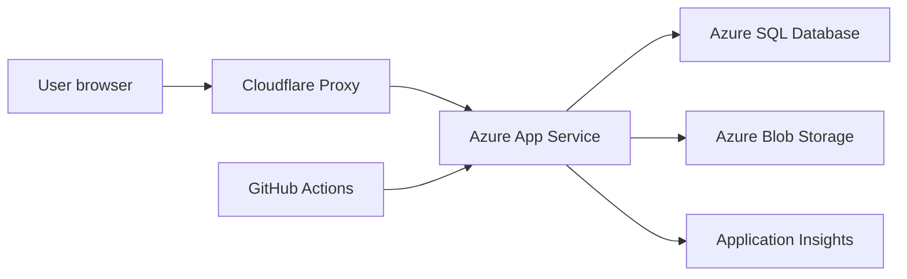

# Azure Hosting Plan

## Initial Azure Architecture


```mermaid
flowchart LR
  User["User browser"] --> CF["Cloudflare Proxy"]
  CF --> App["Azure App Service"]
  App --> Sql["Azure SQL Database"]
  App --> Blob["Azure Blob Storage"]
  App --> Insights["Application Insights"]
  GitHub["GitHub Actions"] --> App
```

## Recommended Services

| Concern | Azure Service | Notes |
| --- | --- | --- |
| Web app | Azure App Service | Linux is fine for ASP.NET Core. Windows only needed for legacy Web Forms. |
| Database | Azure SQL Database | Restore or import legacy DB, then connect read-only at first. |
| Media | Azure Blob Storage | Pictures, thumbnails, downloadable public assets. |
| Telemetry | Application Insights | Request tracking, exceptions, dependency timings. Keep sampling and daily caps low for the hobby budget. |
| Secrets | App Service settings or Key Vault | Start with App Service settings, move to Key Vault if needed. |
| DNS/TLS | Cloudflare proxy plus App Service managed certificates | `www.queenzone.org` and `queenzone.org` are proxied through Cloudflare with SSL/TLS Full (strict). App Service IP restrictions allow Cloudflare origin ranges and deny direct public app ingress. |
| CI/CD | GitHub Actions | Build, test, deploy. |

## Environments

Start with:

- Local development.
- Azure preview.
- Production.

Optional later:

- Staging slot for production swaps.

## Scale and cost model (single instance)

Production runs on **one** App Service worker on plan **ASP-Queenzone** (**B1 Basic**). That is intentional: stay on the lowest paid plan currently in use and **do not** add Azure Cache for Redis or other paid distributed cache for multi-instance correctness.

Process-local caches (public query cache, output cache, in-memory rate-limit hints) are therefore the correct design. Multi-instance scale-out and Redis are **archived / not planned** until budget and traffic force a revisit.

Full decision, live SKU notes, and what remains in scope: [`hosting-scale-and-cache.md`](hosting-scale-and-cache.md).

## Configuration

Use configuration keys like:

- `ConnectionStrings:QueenZoneLegacy`
- `APPLICATIONINSIGHTS_CONNECTION_STRING`
- `Storage:PublicMediaBaseUrl`
- `AzureAd:ClientId` / `AzureAd:TenantId` / related Entra settings (required outside Development)
- `QueenZoneHostFiltering:AllowedHosts` (production default: `www.queenzone.org;queenzone.org;*.azurewebsites.net`)
- `FeatureFlags:ForumArchiveEnabled`
- `FeatureFlags:LegacyRedirectsEnabled`

### Production auth and host hardening

- **Entra admin auth is mandatory** when `ASPNETCORE_ENVIRONMENT` is not `Development` or `Testing`. Placeholder values such as `YOUR_CLIENT_ID` do not count. The process throws at startup if admin Entra is not configured.
- **Do not** enable header-based `X-Test-User-Email` admin auth on App Service. That path only exists for local Development and the automated Testing environment.
- **QueenZoneHostFiltering:AllowedHosts** is locked down in committed `appsettings.json`. ASP.NET Core's framework `AllowedHosts` is deliberately `*`: its automatic middleware runs before the visible application pipeline and rejected App Service's internal startup-probe Host before `/health` could answer (#684). QueenZone applies the same allowlist after the probe short-circuit and forwarded headers. Prefer App Service application settings to extend the QueenZone allowlist when adding domains.
- **Admin allowlist:** committed `Admin:AllowedEmails` is **empty**. Production must set `Admin__AllowedEmails__0` (and further indexes) on App Service or via Key Vault. Startup validation fails in Production/Staging/Preview when the list is empty. See [`entra-admin-auth.md`](entra-admin-auth.md).
- **Secrets in logs:** never log connection strings, client secrets, storage keys, or API keys. Prefer App Service setting name + length when auditing config; health endpoints must not echo exception text containing secrets.

### Data Protection keys

Production, Staging, and Preview persist ASP.NET Core Data Protection keys to
`/home/ASP.NET/DataProtection-Keys` on Linux App Service
(`D:\home\ASP.NET\DataProtection-Keys` on Windows App Service). This is the
[standard Azure Apps key-ring location](https://learn.microsoft.com/aspnet/core/security/data-protection/configuration/default-settings)
on the App Service persistent home share, outside the read-only
`/home/site/wwwroot` package mounted by `WEBSITE_RUN_FROM_PACKAGE=1`. Using the
existing standard location avoids abandoning keys that the framework may already
have written implicitly. Cookie authentication and antiforgery tokens therefore
remain valid across app recycles and deployments on the current App Service.

`DataProtection__KeysPath` may override the location, but it must be an absolute path
outside `wwwroot`. Startup creates the directory and fails immediately if the mount or
permissions are wrong. The framework's existing application discriminator is unchanged,
so explicitly configuring the standard key-ring path does not itself invalidate existing
protected payloads.

This mechanism adds no secret or parallel configuration owner while the App Service
configuration ownership decision in [#618](https://github.com/richardorchard/QueenZone.Modern/issues/618)
remains open. App Service manages encryption at rest for the persistent disk, but the
Data Protection key XML is not separately encrypted by the application. If the site
later requires application-level key encryption or deployment-slot sharing, move the
key ring to Blob Storage and protect it with Key Vault under that decision; do not
commit storage credentials or Key Vault secrets.

### Forwarded headers trust boundary

The app clears `KnownIPNetworks` / `KnownProxies` so `X-Forwarded-For`, `X-Forwarded-Proto`, and `X-Forwarded-Host` from **App Service / Cloudflare** are accepted (required for correct OAuth redirect URIs and scheme).

Immediately after forwarded-header processing, the app adds the trusted Cloudflare `CF-Connecting-IP` value to the active OpenTelemetry request span as `client.address` (falling back to the processed remote address). Application Insights uses that value for visitor geolocation and masks the stored `client_IP` to `0.0.0.0` by default. Keep masking enabled unless a separate privacy review approves raw IP retention.

| Trust | Implication |
| --- | --- |
| Edge is the only public ingress | Normal production path — forwarded headers are trusted |
| Client reaches Kestrel without the edge | Client can spoof `X-Forwarded-For` (and thus IP-based rate-limit partitions) |

**Policy:**

- Treat **IP-based rate limits as soft** (auth start, search, anonymous partitions).
- Prefer **authenticated member id** for write/upload rate partitions when a principal is present.
- Forum post limits use **member id + DB count**, not IP.
- Do not put private admin actions behind IP allowlists derived from `X-Forwarded-For` alone.

If a second public path to the app is ever opened (direct App Service hostname without Cloudflare, extra VNet ingress), re-evaluate this model or terminate TLS only at a single trusted reverse proxy.

### Rate limiting (process-local, single B1)

Named policies (429 when exceeded):

| Policy | Surfaces | Partition | Default |
| --- | --- | --- | --- |
| `qz-auth` | `/account/login`, `/account/externallogin` | Client IP | 30 / minute |
| `qz-member-write` | `/submit/*` | Member id, else IP | 20 / minute |
| `qz-upload` | editor image API, account settings (avatar) | Member id, else IP | 30 / minute |
| `qz-search` | `/search` | Client IP | 60 / minute |
| Fan performance | audio / browse | Member or IP | Config section `RateLimiting:FanPerformances` |
| Forum posts | new thread / reply | Member + DB probe | 5 / minute; **fail-closed** if probe errors |

No Redis: limits are per process. Correct on single-instance B1; see [`hosting-scale-and-cache.md`](hosting-scale-and-cache.md).

**Runbook (live Entra app, App Service keys, secret rotation):** see [`docs/architecture/entra-admin-auth.md`](entra-admin-auth.md).

Summary of what is live on App Service `queenzone-dev` (as of 2026-07-23):

| Item | Note |
| --- | --- |
| Entra app | **QueenZone Admin** — client ID `f6d32f3b-7a4e-4517-a4d1-0995caad8feb` |
| Settings | `AzureAd__Instance`, `TenantId` (`common`), `ClientId`, `ClientSecret`, `CallbackPath` |
| Admin allowlist | `Admin__AllowedEmails__N` on App Service (not committed appsettings) |
| Secret renewal | Client secret created 2026-07-23 for 2 years — **renew by 2028-07-01** (procedure in entra-admin-auth.md) |
| Member OAuth | Separate app **queenzone member login** and `Authentication__*` settings — not the admin OIDC app |

### Health probes

| Path | Purpose | Dependencies |
| --- | --- | --- |
| `/health` | **Liveness** — process is up | None (always cheap JSON `{ "status": "ok" }`) |
| `/health/ready` | **Readiness** — can serve traffic that needs SQL/blob | SQL when `ConnectionStrings:QueenZoneLegacy` is set; blob when `ConnectionStrings:BlobStorage` is set. Unconfigured dependencies report **Healthy** with a "not configured" description (sample-data local mode). Failures return **503** without secrets or exception text. |
| `/warmup` | **Warmup** — deployment/startup gate for public traffic | Runs readiness checks, then primes process-local public query caches for hot public routes. Failures return **503** with a minimal body and no dependency or exception details. |

Use `/health` for App Service / CI pings. Point deeper monitors at `/health/ready` when you want SQL/blob failure to page.

For the B1 App Service plan, keep deployment slots out of the critical path and configure App Service startup warmup:

```text
WEBSITE_WARMUP_PATH=/health
```

`WEBSITE_WARMUP_PATH` points at `/health`, **not** `/warmup`, deliberately. `WEBSITE_WARMUP_STATUSES` stays unset, so any HTTP response proves the container is listening; requiring exactly 200 turned an internal-host 400 into a 230-second crash loop (#684). QueenZone short-circuits probe paths before its explicit host filter, so `/health` now returns 200 even when App Service uses a link-local Host header. `deploy.yml`'s own "Warm up custom domain" step remains the strict readiness gate: it recycles via Kudu, polls `/warmup`, and requires `/` to serve the new `data-build-version`, then post-deploy smoke checks representative public routes.

### `/warmup` duration budget

Theoretical worst case when SQL and blob are configured. These are **timeout ceilings**, not live measurements. The #666 investigation could not produce a reliable empirical `/warmup` time (Azure recycle / traffic-swap, no per-request duration logs). `/warmup` now logs structured `WarmupDurationMs`, `WarmupReadinessMs`, `WarmupCacheMs`, `SqlDurationMs`, and `BlobDurationMs` so a later deploy can read real timings from App Service / Application Insights.

| Phase | Bound | Notes |
| --- | --- | --- |
| Readiness — `SqlReadyHealthCheck` | **15s** | Explicit `CancelAfter` around `CanConnectAsync`, independent of EF `EnableRetryOnFailure` (5 retries, 20s max delay, 100s+ unbounded). Unconfigured SQL is immediate Healthy. |
| Readiness — `BlobReadyHealthCheck` | **unbounded** | Still rides the Azure SDK call with no extra timeout. A hung blob probe can stall `/warmup`. Out of scope for #674. |
| Cache priming — `PublicWarmupService` | **8s** | Nine independent public-query reads run concurrently (`Task.WhenAll`), each with an 8s `CancelAfter`. Each step uses its own DI scope so EF repositories do not share a `DbContext`. Worst case is the slowest step, not 9 × 8s. |
| **SQL-healthy / blob-healthy total** | **~23s + overhead** | Readiness is `max(sql, blob)` (health checks run in parallel), then cache priming is `max(steps)`. |

Local sample-data (no SQL/blob) on this change: **287ms** cold `/warmup`, **11ms** warm. That is a lower bound only — it does not include Azure SQL connect or real cache queries.

Probe paths are answered by a short-circuit registered as the first middleware after `builder.Build()` (#681), before QueenZone's explicit host filter (#684), and they also skip the authenticated branch (#677). ASP.NET Core's automatic `AllowedHosts` filter is disabled because it runs outside that visible ordering. A cold-container `/health` or `/warmup` must not wait on host validation, Entra OIDC metadata, static files, or anything else later in the pipeline.

Do not point `WEBSITE_WARMUP_PATH` back at `/warmup` just because this budget is now bounded. The platform gate should stay cheap (#673).

Do **not** set `WEBSITE_RUN_FROM_PACKAGE` through Kudu `POST /api/settings`. That call returns 204 but does not persist an ARM application setting; after #660 OneDeploy reported success while the worker kept serving the previous extracted `wwwroot`.

`WEBSITE_RUN_FROM_PACKAGE`, `WEBSITE_WARMUP_PATH`, and `WEBSITE_WARMUP_STATUSES` are owned by ARM (#666): `deploy.yml`'s `configure-app-settings` job logs in via `azure/login` with a dedicated OIDC identity (GitHub environment `deploy`, Website Contributor scoped to the `queenzone-dev` site only — not the resource group, and separate from the `dev` environment's Bitwarden publish-profile identity), then runs `az webapp config appsettings set` before the zip deploy runs. With `WEBSITE_RUN_FROM_PACKAGE=1` set through ARM, OneDeploy mounts the zip read-only (`is_readonly: true`) instead of extracting it. That mount does swap the package, but after #688 skipping the extra Kudu `POST /api/app/restart` left `/warmup` on HTTP 500 and `/` flaking (run 31812172927). Deploy still recycles via Kudu after the push, then polls `/warmup` **and** `data-build-version` on `/` (the PR-head short SHA baked into the CI publish artifact); post-deploy smoke repeats the stamp check on the content-route suite. A standalone Kudu-side delete of the key does not clear the ARM setting; ARM is the only writer.

Enable **Always On** for the App Service when available on the active SKU so the single B1 worker is not unloaded after idle periods. Always On prevents idle cold starts; `WEBSITE_WARMUP_PATH` controls the platform startup ping when the app process/container starts. Keep the GitHub Actions post-deploy smoke route suite in place after `/warmup` passes, because real public pages still prove routing, Razor rendering, and output-cache behavior on the custom domain.

### SQL Server EF options (runtime)

- Default command timeout: **30s** (was 300s) so runaway public queries release connections sooner.
- `EnableRetryOnFailure` for Azure SQL transient faults (5 retries, max delay 20s).
- Design-time migrations / long tools still use a **300s** timeout via `QueenZoneDbContextFactory`.
- Hot forum paths that need longer still raise timeout per command in those repositories.

### News discovery outbound HTTP (SSRF)

The news agent worker fetches admin-configured feed/page URLs. Guards:

- Absolute **http/https** URLs only (no `file:`, `gopher:`, etc.).
- Hostnames such as `localhost`, `*.local`, `*.internal`, cloud metadata names blocked.
- After DNS, connections to private/link-local/CGNAT/metadata address ranges are refused (including redirect hops via `SocketsHttpHandler.ConnectCallback`).
- Response body capped (default 5 MB).

See `QueenZone.NewsAgent.OutboundUrlSafety` and `SsrfSafeSocketsHttpHandler`.

Application Insights telemetry is enabled in `QueenZone.Web` only when
`APPLICATIONINSIGHTS_CONNECTION_STRING` is configured. The app uses Azure Monitor
OpenTelemetry with conservative defaults in `ApplicationInsights`: 0.2 traces per
second, warning-or-higher exported logs, trace-based log sampling, and Live
Metrics disabled. In Azure, configure a small daily cap on both Application
Insights and the backing Log Analytics workspace so unexpected telemetry volume
is budget-contained.

## Public Media Delivery

Public archive media is served from Azure Blob Storage through two Cloudflare hostnames. They are **not** interchangeable (verified live 2026-08-12; see [`opentofu-inventory.md`](opentofu-inventory.md)):

```text
Photos/images:  https://cdn.queenzone.org/{container}/{blob}
                Cloudflare straight proxy (no Worker)
                Azure Storage custom domain: cdn.queenzone.org on account queenzone
                Origin: https://queenzone.blob.core.windows.net

Audio/legacy attachments CDN:
                https://cdn2.queenzone.org/{container}/{blob}
                Cloudflare Worker proxy (sets response headers)
                No Azure custom domain on cdn2 — Worker fetches the blob origin host
```

### `cdn.queenzone.org` (photos / images)

Straight proxied CNAME to the storage account, accepted by Azure because **`cdn.queenzone.org` is registered as the storage account custom domain**. Responses pass through Azure blob headers; Cloudflare applies its default edge cache (`Cache-Control: max-age=14400` observed). This hostname cannot set custom download filenames.

DNS shape:

```text
Type: CNAME
Name: cdn
Target: queenzone.blob.core.windows.net
Proxy status: Proxied
TTL: Auto
```

### `cdn2.queenzone.org` (legacy attachment redirect target)

Worker script **`pictures-queenzone-org`** (historical name) on route **`cdn2.queenzone.org/*`**. Source snapshot: [`infra/import/workers/pictures-queenzone-org.js`](../../infra/import/workers/pictures-queenzone-org.js).

Live Worker behaviour:

- Accepts `GET` / `HEAD` only; rewrites path to `https://queenzone.blob.core.windows.net`
- Returns **404** for `/songfiles` and `/songfiles/*` (fan audio is app-proxied; #177)
- Adds `Access-Control-Allow-Origin: *`
- Adds `X-Content-Type-Options: nosniff`
- Sets `Cache-Control: public, max-age=86400, s-maxage=2592000` on HTTP 200
- Does **not** currently set `Content-Disposition` (the fan-performance app proxy sets it)

Used by legacy forum attachment redirects after member auth. Do not attach this Worker to `cdn`. The Worker is not yet an OpenTofu-managed resource (#626); deploy script updates separately after the app proxy is live.

### Fan-performance audio (#177)

Signed-in members play and download through `GET /fan-performances/{id}/audio`, which streams from the private `songfiles` container using `ConnectionStrings:BlobStorage` (same storage account as UGC). The modern app must not emit `cdn2.queenzone.org/songfiles/…` or raw blob URLs in HTML.

Apply order after merge:

1. Deploy the web app so the audio endpoint streams instead of redirecting.
2. Publish the Worker snapshot so anonymous `cdn2` `/songfiles/*` returns 404.
3. Apply the OpenTofu `songfiles` container ACL change (`None`) via the protected workflow. Do not apply from a local operator session, and do not flip the ACL before step 1.

### Azure storage requirements

- Account `queenzone` keeps blob public access enabled for legacy public gallery containers.
- Public archive containers must remain public where visitor access is expected.
- `databasebackup`, `ugc-avatars`, `ugc-forum`, and `songfiles` are private.
- Legacy `attachments` remain public blob access (out of scope for #177).

### Post-deploy smoke (#177)

After the app deploy, Worker publish, and OpenTofu apply:

```powershell
# Anonymous CDN and raw blob URLs must fail (403/404).
curl.exe -I https://cdn2.queenzone.org/songfiles/2014417798057369.mp3
curl.exe -I https://queenzone.blob.core.windows.net/songfiles/2014417798057369.mp3

# Signed-in member playback: open /fan-performances, sign in, play a row.
# Expect 200 from /fan-performances/{id}/audio with audio/mpeg and no Location
# redirect to cdn2 or *.blob.core.windows.net.
```

The nightly RealData suite asserts the anonymous CDN/blob denial in `LiveSiteMediaCdnTests`. Those checks fail until steps 2–3 above have been applied.

Do not add Azure CDN or Azure Front Door for these hostnames unless the architecture is deliberately changed. Keep the existing Azure Storage custom domain for `cdn.queenzone.org` — removing it breaks the non-Worker photo CDN.

## Database Access

The `queenzone-dev` App Service connects to the `queenzone-db` Azure SQL database on `queenzone-sql-server.database.windows.net`.

The current runtime route uses SQL authentication. Store the runtime connection string only in the App Service setting `ConnectionStrings__QueenZoneLegacy`:

```text
Server=tcp:queenzone-sql-server.database.windows.net,1433;Database=queenzone-db;User ID=...;Password=...;Encrypt=True;TrustServerCertificate=False;
```

GitHub Actions uses a separate `QUEENZONE_LEGACY_MIGRATION_CONNECTION_STRING` environment secret for EF Core migrations during deployment. Updating that GitHub secret does not update the live App Service runtime setting.

Create the runtime database user inside the target database, not `master`, and grant only the permissions required by the enabled application paths:

```sql
CREATE USER [app_login_name] FOR LOGIN [app_login_name];
ALTER ROLE db_datareader ADD MEMBER [app_login_name];
```

Local development should use local-only secrets in `appsettings.Local.json`, shell environment variables, or `.env`. Do not commit copied Azure connection strings.

Only grant write permissions when the deployed app has an intentional write path:

```sql
ALTER ROLE db_datawriter ADD MEMBER [app_login_name];
```

Admin news publishing is an intentional write path, so the production runtime login needs write access for `NEWS_T` and `NewsAuditLog` once that workflow is enabled.

## Deployment Checklist

- Build succeeds in GitHub Actions.
- Tests pass.
- App starts without database write permissions.
- Health endpoint returns OK.
- Cloudflare proxy is Proxied (orange cloud) for `www.queenzone.org` and `queenzone.org`.
- Application Insights receives requests.
- Canonical URLs are tested.
- No connection strings or secrets are committed.
- App Service runtime settings and GitHub environment secrets are both updated when database credentials rotate.
