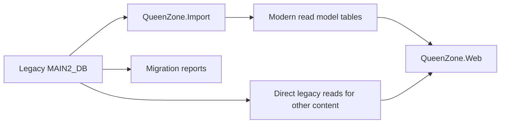

# Database Evolution Plan

## Position

The legacy `MAIN2_DB` schema is an import source and historical reference.

QueenZone Modern may keep reading most public archive content from legacy tables. Modern projected tables are introduced when a content area needs better performance, privacy boundaries, or maintainability — not as a blanket rewrite of every legacy read.

## Current State

- **Forum archive:** migrated. Public `/forum` routes read `ModernForum*` tables by default via `ModernForumRepository` (`ForumData:UseModernForumReads = true`). See `docs/sql/006-modern-forum-read-path.sql` and `docs/performance/forum-read-benchmark-2026-06-29.md`.
- **Other public content:** continue legacy table/stored-procedure reads unless we discover performance or safety problems.
- **Editorial/admin workflows:** use deliberately designed modern tables (news admin columns, discovery, audit) rather than extending legacy write paths.

## Why Forum Needed Modern Tables

Forum was the main pressure point:

- Topic and reply data lived in large legacy `Q_FORUM_TOPIC_T` structures.
- Parent/child relationships were expensive to page for modern archive routes.
- Search and archive browsing needed indexes that suit modern URLs.
- User/account fields sat close to public post data.
- Attachment, moderation, and tracker-adjacent data needed careful separation.

## Recommended Pattern

Use an import/project pattern when a content area needs it:

Forum already follows the modern-table path. Other archive areas may stay on direct legacy reads until evidence says otherwise.

## Candidate Modern Tables

Names are placeholders.

### Content

- `ContentItem`
- `ContentCategory`
- `ContentRevision`
- `LegacyContentSource`

### Redirects

- `LegacyRedirect`

Fields:

- `Id`
- `OldPath`
- `OldQuery`
- `TargetPath`
- `ContentType`
- `LegacyId`
- `StatusCode`

### Media

- `MediaAsset`
- `MediaVariant`
- `LegacyMediaSource`

### Forum Archive

Shipped as imported `ModernForum*` tables (see `ModernForumRepository` and `docs/sql/006-modern-forum-read-path.sql`). Placeholder names below map to that family:

- `ForumCategory`
- `ForumThread`
- `ForumPost`
- `ForumAuthorSnapshot`
- `ForumAttachment`
- `ForumModerationFlag`

### Search

- `SearchDocument`

Fields:

- `Id`
- `ContentType`
- `ContentId`
- `Title`
- `Body`
- `AuthorDisplayName`
- `PublishedAt`
- `Url`

## Migration Rules

- Do not mutate legacy data during early migration.
- Prefer read-only credentials for the legacy database.
- Store imported modern data in separate tables or a separate database.
- Keep `LegacyId` fields on modern records.
- Keep import runs repeatable.
- Generate reports for skipped, hidden, malformed, or unsafe records.
- Do not import private messages, emails, password fields, IP addresses, or private profile fields into public read models.

## Forum Archive Status

Completed for the public browse path:

1. Forum/thread/post data imported into `ModernForum*` tables.
2. Public category, topic, and post pages render from modern tables by default.
3. Read-path procedures and covering indexes are documented and benchmarked.
4. Legacy forum SQL remains available as fallback/historical source via `ForumData:UseModernForumReads`.

Remaining forum follow-ups (not blockers for the modern-table decision):

- Keep import/reconciliation and `ModernForum_RefreshReadStats` healthy after future imports.
- Decide full-text search hosting (Azure SQL full-text vs Azure AI Search).
- Confirm profile-link and takedown/moderation policy for archive authors.

## Open Questions

- Should the new project keep legacy and modern tables in one Azure SQL database, or use separate databases?
- Should forum archive content be indexed in Azure SQL full-text or Azure AI Search?
- Should old user profile links be preserved, anonymized, or disabled?
- How should takedown/moderation requests be handled after launch?
- Which non-forum content areas, if any, show enough performance or privacy pressure to justify their own modern projections?
