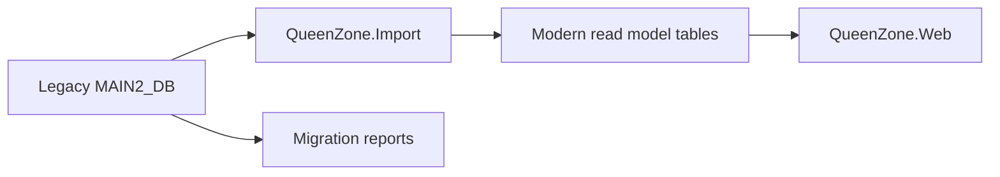

# Database Evolution Plan

## Position

The legacy `MAIN2_DB` schema is an import source and historical reference, not the final shape of QueenZone Modern.

The new application can initially read from legacy tables and stored procedures, but it should be allowed to create modern tables where the legacy schema is inefficient, risky, or awkward.

## Why This Matters

The forum database is likely the main pressure point:

- Topic and reply data appears to live in `Q_FORUM_TOPIC_T`.
- Parent/child relationships are old-style and may be expensive to page.
- Search and archive browsing will need indexes that suit modern routes.
- User/account fields sit close to public post data.
- Attachment, moderation, and tracker-adjacent data need careful separation.

For a public archive, we need a schema optimized for:

- Forum list pages.
- Thread pages.
- Post pagination.
- Author display names without private fields.
- Canonical route metadata.
- Full-text search.
- Content hiding or takedown.

## Recommended Pattern

Use an import/project pattern:

The web app may read legacy tables directly during early phases, but long-lived public features should move to modern read models.

## Candidate Modern Tables

Names are placeholders.

### Content

- `ContentItem`
- `ContentCategory`
- `ContentRevision`
- `LegacyContentSource`

### Redirects

- `LegacyRedirect`

Fields:

- `Id`
- `OldPath`
- `OldQuery`
- `TargetPath`
- `ContentType`
- `LegacyId`
- `StatusCode`

### Media

- `MediaAsset`
- `MediaVariant`
- `LegacyMediaSource`

### Forum Archive

- `ForumCategory`
- `ForumThread`
- `ForumPost`
- `ForumAuthorSnapshot`
- `ForumAttachment`
- `ForumModerationFlag`

### Search

- `SearchDocument`

Fields:

- `Id`
- `ContentType`
- `ContentId`
- `Title`
- `Body`
- `AuthorDisplayName`
- `PublishedAt`
- `Url`

## Migration Rules

- Do not mutate legacy data during early migration.
- Prefer read-only credentials for the legacy database.
- Store imported modern data in separate tables or a separate database.
- Keep `LegacyId` fields on modern records.
- Keep import runs repeatable.
- Generate reports for skipped, hidden, malformed, or unsafe records.
- Do not import private messages, emails, password fields, IP addresses, or private profile fields into public read models.

## Forum Archive Specific Plan

1. Count forums, threads, replies, hidden/deleted markers, and attachments.
2. Identify all author fields used on public pages.
3. Define privacy rules for usernames, signatures, avatars, profile links, and deleted users.
4. Build a sample import for one forum category.
5. Render read-only category, thread, and post pages from modern tables.
6. Compare against legacy output.
7. Add full-text search only after the browse model works.

## Open Questions

- Should the new project keep legacy and modern tables in one Azure SQL database, or use separate databases?
- Should forum archive content be indexed in Azure SQL full-text or Azure AI Search?
- Should old user profile links be preserved, anonymized, or disabled?
- How should takedown/moderation requests be handled after launch?
