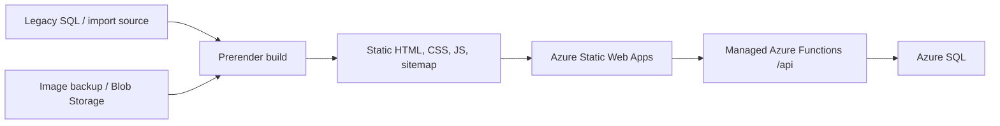
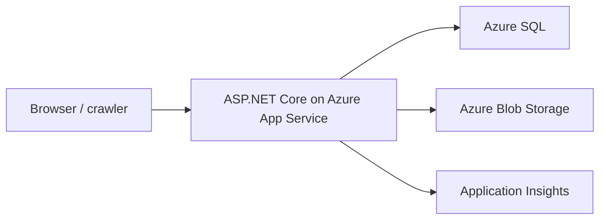
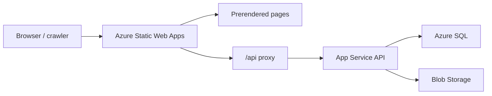

# Hosting Options Exploration

## Purpose

QueenZone Modern may not need to be a traditional always-server-rendered web app. Much of the first release can be generated as static HTML from legacy content, which opens up a fast, SEO-friendly, low-operational-cost architecture.

This document compares Azure Static Web Apps and Azure App Service for the read-only-first rebuild.

## Option A: Azure Static Web Apps With Prerender

### What Fits Well

- Homepage.
- News pages.
- Article pages.
- Biography pages.
- Album and song pages, subject to lyrics policy.
- FAQ.
- Picture category and picture detail pages, once image URLs are stable.
- XML sitemap.
- RSS feeds if generated at build time.
- Clean canonical URLs via static route rules where possible.

### What Functions Can Handle

- Search API, if not fully static.
- Contact form.
- Lightweight stats endpoints.
- Redirect lookup for complex legacy query-string URLs.
- Incremental content preview later.
- Admin-only import triggers later, if needed.

### Strengths

- Very fast public pages.
- Strong SEO because crawlers get complete HTML.
- Lower runtime cost.
- Smaller attack surface.
- Built-in GitHub/Azure DevOps deployment flow.
- Static assets are globally distributed.
- Managed Functions can sit behind `/api` without CORS fuss.

### Constraints

- Dynamic APIs have the Static Web Apps API limits.
- Built-in API routes use `/api`.
- API requests have execution limits.
- If every page needs live database rendering, Static Web Apps becomes less natural.
- Bring-your-own APIs require Standard plan.
- Search or dynamic lookup may need a Function or an edge/front-door rule.

## Option B: Azure App Service With ASP.NET Core

### What Fits Well

- Server-rendered Razor Pages or MVC.
- Database-driven content.
- Dynamic search or lookup behavior.
- Admin tools.
- Auth.
- Future interactive features.
- Search endpoints.
- Import jobs via WebJobs or background services.

### Strengths

- Flexible.
- Straightforward ASP.NET Core deployment.
- Easier if pages need live database reads.
- Better fit for future admin/auth/community functionality.
- Can still generate excellent SEO pages through server rendering.

### Constraints

- More runtime surface than static hosting.
- Usually higher baseline cost.
- More need to monitor application performance.
- Global edge caching needs additional design.

## Option C: Hybrid Static Front End Plus App Service API

This keeps public content static and fast, while using a full App Service backend for APIs, import tools, admin, or later interactive features.

Use this if:

- Public pages are mostly static.
- Admin/import functions become too complex for managed Functions.
- We want static hosting for SEO and performance but still want a full .NET backend.

## Recommendation

Start by proving a prerendered Static Web Apps path.

The first experiment should generate static pages for:

- Homepage.
- News list and detail.
- Biography.
- Albums.
- Picture category index using known Blob/image URLs.

If prerendering feels clean, continue with Static Web Apps as the public host. If search, dynamic lookup, and import complexity become awkward, move to the hybrid model before defaulting to full App Service.

## Decision Criteria

| Question | Static Web Apps | App Service |
| --- | --- | --- |
| Can most pages be generated at build/import time? | Strong fit | Still fine |
| Need live per-request SQL rendering? | Weak fit | Strong fit |
| Need admin/auth soon? | Possible, but limited | Strong fit |
| Need lowest public-page latency? | Strong fit | Needs caching/CDN |
| Need dynamic search or lookup handling? | Possible with Functions/rules | Strong fit |
| Need future community features? | Likely hybrid | Strong fit |

## Proof Of Concept

Build a small generator/import path:

1. Read legacy news, biography, albums, and picture categories.
2. Generate static HTML.
3. Generate sitemap XML.
4. Generate canonical routes for known public pages.
5. Deploy to Azure Static Web Apps preview.
6. Add one Function for search or dynamic lookup.

The result will tell us whether Static Web Apps should be the primary public host.
